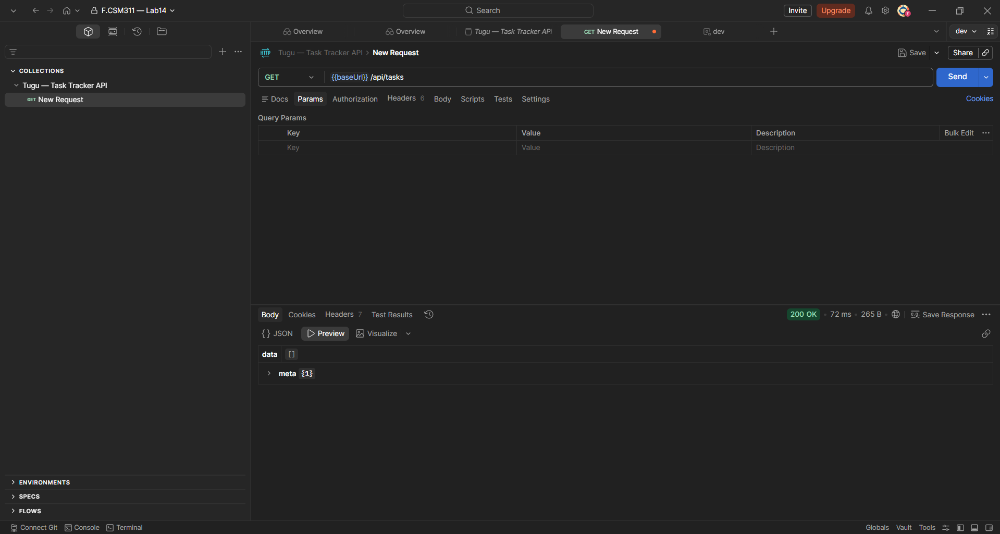
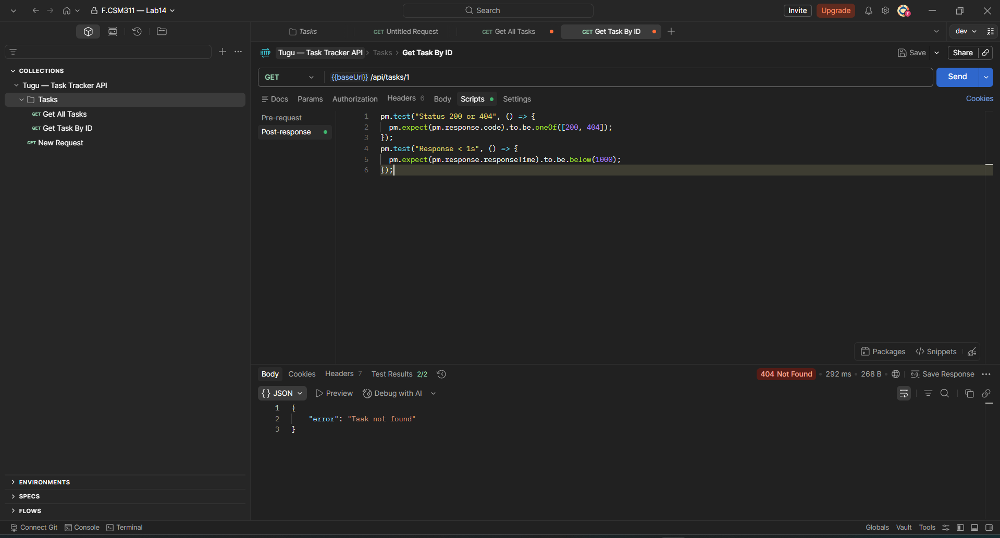
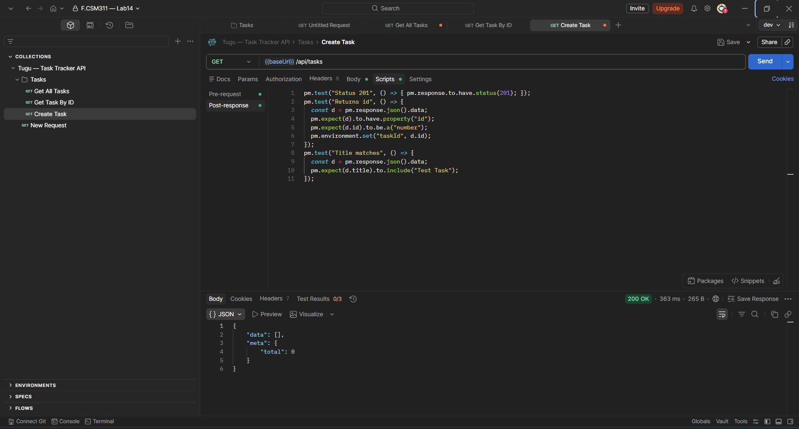
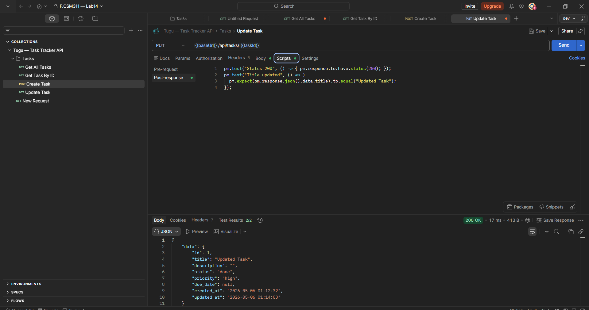
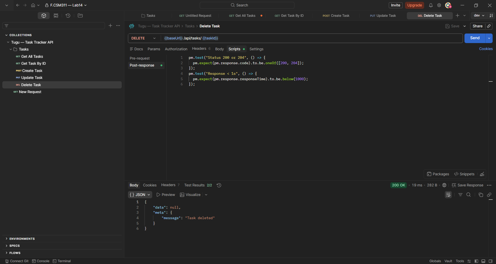
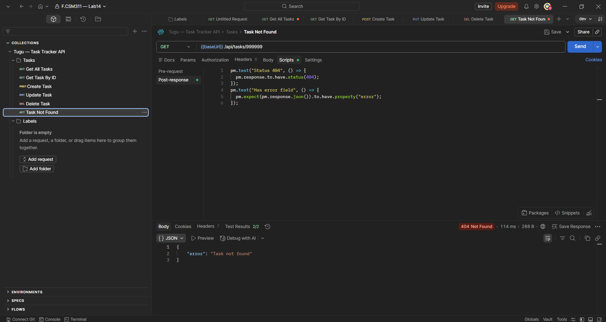
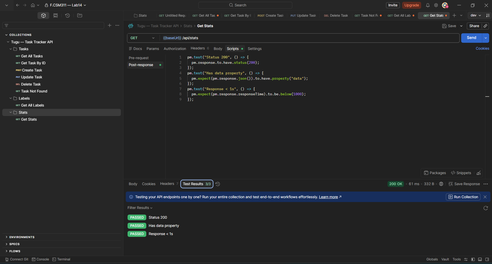
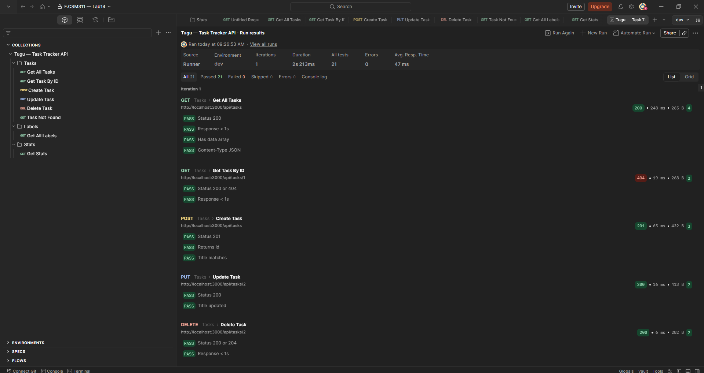
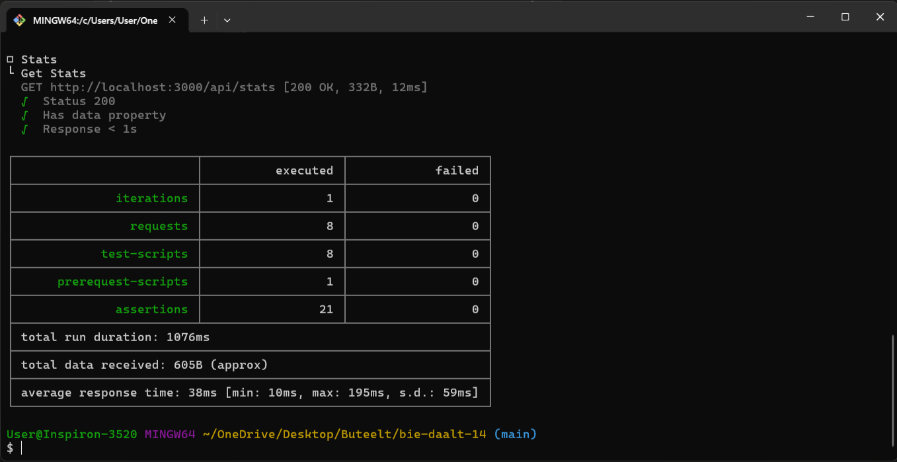
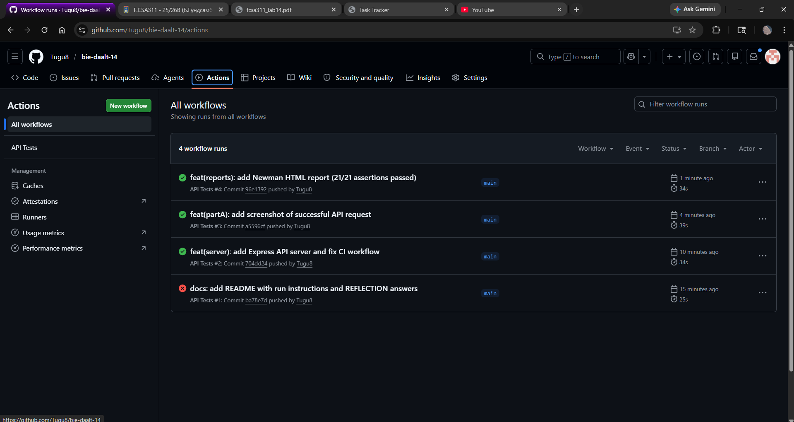

# Бие даалт 14 — API Testing with Postman + Newman

**Хувилбар 3** — Өөрийн Express сервер (Personal Task Tracker API)
**Оюутан:** Tugu8
**Хичээл:** F.CSM311 — Программ хангамжийн бүтээлт

---

## Товч тайлбар

Node.js + Express + SQLite дээр суурилсан Personal Task Tracker REST API-г Postman ашиглан тестэлсэн. Newman CLI-аар командын мөрнөөс ажиллуулж, GitHub Actions-д CI pipeline холбосон.

---

## Repository бүтэц

```
bie-daalt-14/
├── README.md
├── REFLECTION.md
├── partA/
│   ├── SETUP.md
│   └── Screenshot.png
├── postman/
│   ├── collection.json
│   ├── env.dev.json
│   └── env.ci.json
├── .github/
│   └── workflows/
│       └── api-tests.yml
├── reports/
│   └── api.html
├── docs/
│   └── screenshots/
└── server/
    ├── package.json
    └── src/
```

---

## Хэрэгсэл

- [Postman](https://www.postman.com/downloads/) — Desktop app
- Node.js 18+
- Newman CLI

---

## Ажиллуулах заавар

### 1. API серверийг эхлүүлэх

```bash
cd server
npm install
npm start
```

Сервер `http://localhost:3000` дээр ажиллана.

### 2. Newman суулгах

```bash
npm install -g newman newman-reporter-htmlextra
```

### 3. Тест ажиллуулах

```bash
newman run postman/collection.json -e postman/env.dev.json
```

### 4. HTML report үүсгэх

```bash
newman run postman/collection.json \
  -e postman/env.dev.json \
  --reporters cli,htmlextra \
  --reporter-htmlextra-export reports/api.html
```

---

## Environment хувьсагч

| Variable | Dev утга | Тайлбар |
|----------|----------|---------|
| `baseUrl` | `http://localhost:3000` | Серверийн хаяг |
| `taskId` | _(автомат)_ | Create Task-аас chain-ээр авна |
| `testTitle` | _(автомат)_ | Pre-request script-аар үүсгэнэ |

---

## Collection бүтэц — 8 Request

### Tasks Folder

---

#### 1. Get All Tasks
**Method:** `GET` | **URL:** `{{baseUrl}}/api/tasks`

Бүх task-уудын жагсаалтыг авна. `data` array болон `meta` object агуулсан JSON буцаана.



**Test assertions (4):**
```js
pm.test("Status 200", () => { pm.response.to.have.status(200); });
pm.test("Response < 1s", () => { pm.expect(pm.response.responseTime).to.be.below(1000); });
pm.test("Has data array", () => {
  pm.expect(pm.response.json()).to.have.property("data");
  pm.expect(pm.response.json().data).to.be.an("array");
});
pm.test("Content-Type JSON", () => { pm.response.to.have.header("Content-Type"); });
```

---

#### 2. Get Task By ID
**Method:** `GET` | **URL:** `{{baseUrl}}/api/tasks/1`

ID-аар нэг task хайна. DB хоосон үед 404 буцаана.



**Test assertions (2):**
```js
pm.test("Status 200 or 404", () => {
  pm.expect(pm.response.code).to.be.oneOf([200, 404]);
});
pm.test("Response < 1s", () => { pm.expect(pm.response.responseTime).to.be.below(1000); });
```

---

#### 3. Create Task
**Method:** `POST` | **URL:** `{{baseUrl}}/api/tasks`

Шинэ task үүсгэнэ. Pre-request script-аар `testTitle` автоматаар үүсгэж, response-оос `taskId`-г environment-д хадгална (chain).



**Pre-request script:**
```js
pm.environment.set("testTitle", "Test Task " + Date.now());
```

**Body:**
```json
{ "title": "{{testTitle}}", "priority": "high" }
```

**Test assertions (3):**
```js
pm.test("Status 201", () => { pm.response.to.have.status(201); });
pm.test("Returns id", () => {
  const d = pm.response.json().data;
  pm.expect(d).to.have.property("id");
  pm.expect(d.id).to.be.a("number");
  pm.environment.set("taskId", d.id);
});
pm.test("Title matches", () => {
  pm.expect(pm.response.json().data.title).to.include("Test Task");
});
```

---

#### 4. Update Task
**Method:** `PUT` | **URL:** `{{baseUrl}}/api/tasks/{{taskId}}`

Create Task-аас авсан `{{taskId}}`-г ашиглан task-ыг засна.



**Body:**
```json
{ "title": "Updated Task", "status": "done" }
```

**Test assertions (2):**
```js
pm.test("Status 200", () => { pm.response.to.have.status(200); });
pm.test("Title updated", () => {
  pm.expect(pm.response.json().data.title).to.equal("Updated Task");
});
```

---

#### 5. Delete Task
**Method:** `DELETE` | **URL:** `{{baseUrl}}/api/tasks/{{taskId}}`

`{{taskId}}`-тай task-ыг устгана. `"Task deleted"` мессеж буцаана.



**Test assertions (2):**
```js
pm.test("Status 200 or 204", () => {
  pm.expect(pm.response.code).to.be.oneOf([200, 204]);
});
pm.test("Response < 1s", () => { pm.expect(pm.response.responseTime).to.be.below(1000); });
```

---

#### 6. Task Not Found (Negative test)
**Method:** `GET` | **URL:** `{{baseUrl}}/api/tasks/999999`

Байхгүй ID явуулж 404 хариу авна — алдааны замыг шалгах.



**Test assertions (2):**
```js
pm.test("Status 404", () => { pm.response.to.have.status(404); });
pm.test("Has error field", () => {
  pm.expect(pm.response.json()).to.have.property("error");
});
```

---

### Labels Folder

#### 7. Get All Labels
**Method:** `GET` | **URL:** `{{baseUrl}}/api/labels`

**Test assertions (2):** Status 200, data is array

---

### Stats Folder

#### 8. Get Stats
**Method:** `GET` | **URL:** `{{baseUrl}}/api/stats`

Task-уудын статистик мэдээлэл.



**Test assertions (3):** Status 200, has data property, Response < 1s

---

## Run Collection — 21/21 PASSED



---

## Newman CLI үр дүн



```
requests:           8  /  0 failed
assertions:        21  /  0 failed
total run duration: 1076ms
average response time: 38ms
```

---

## GitHub Actions CI

Push хийх бүрт автоматаар Newman ажиллана.


